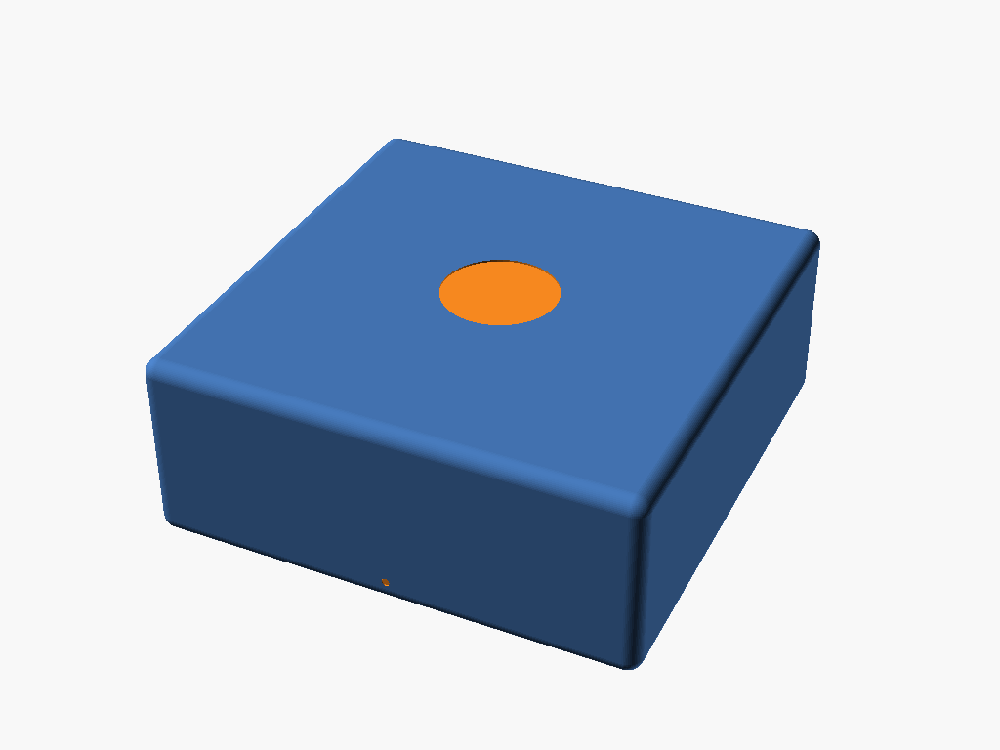
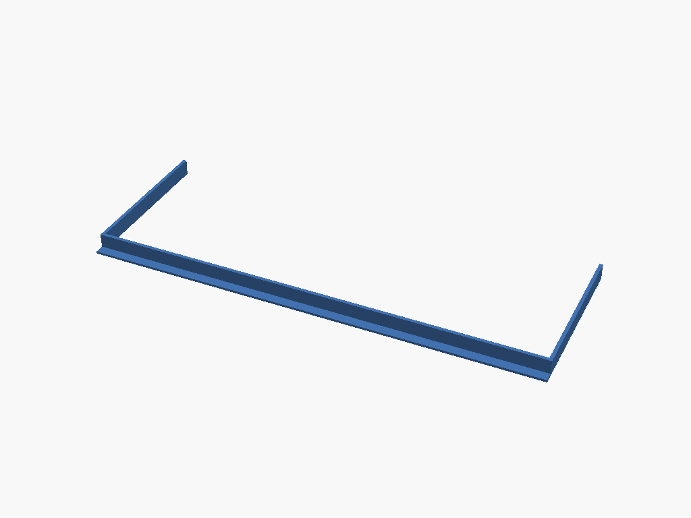
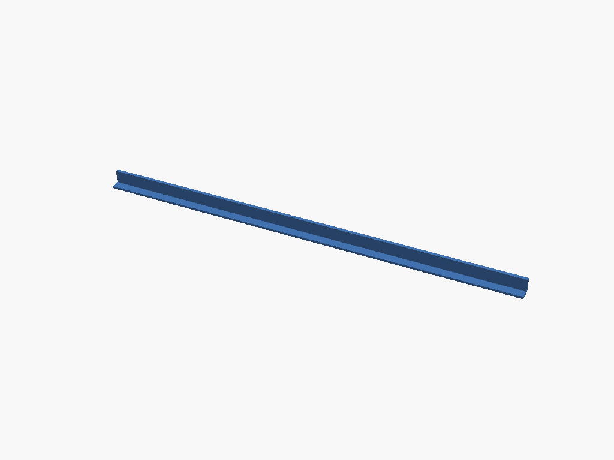
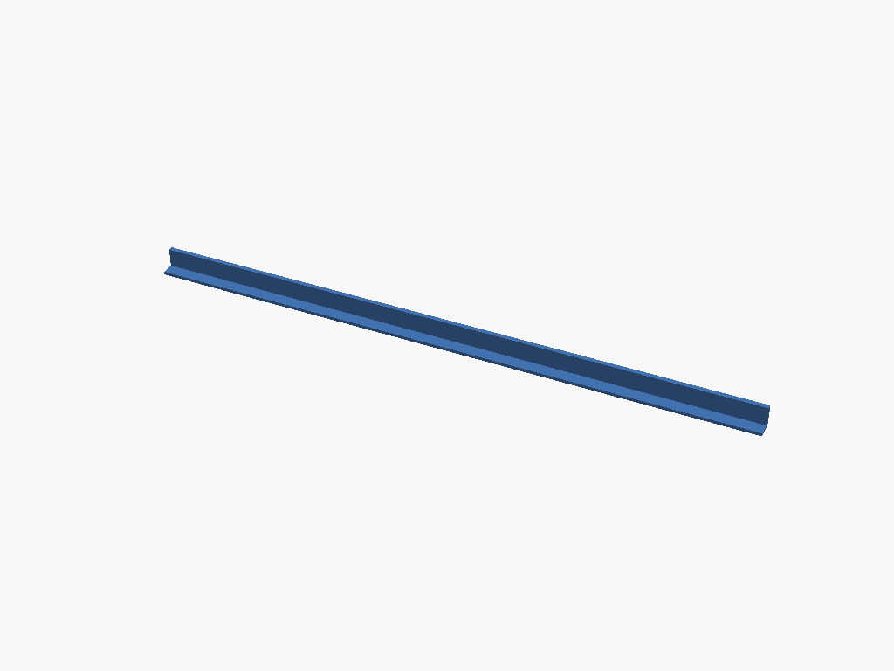
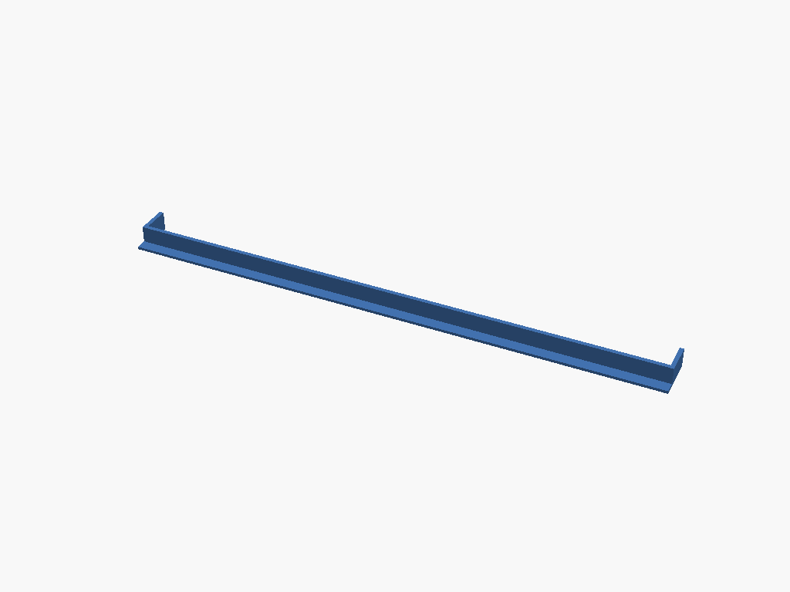
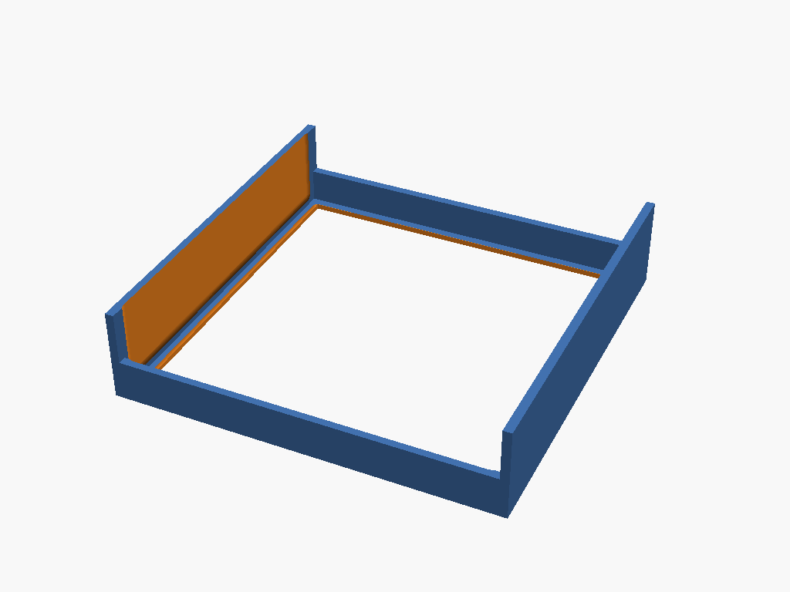
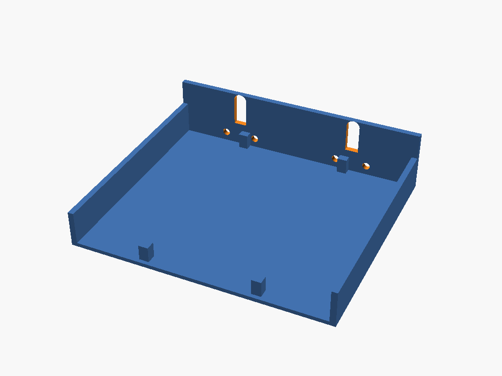
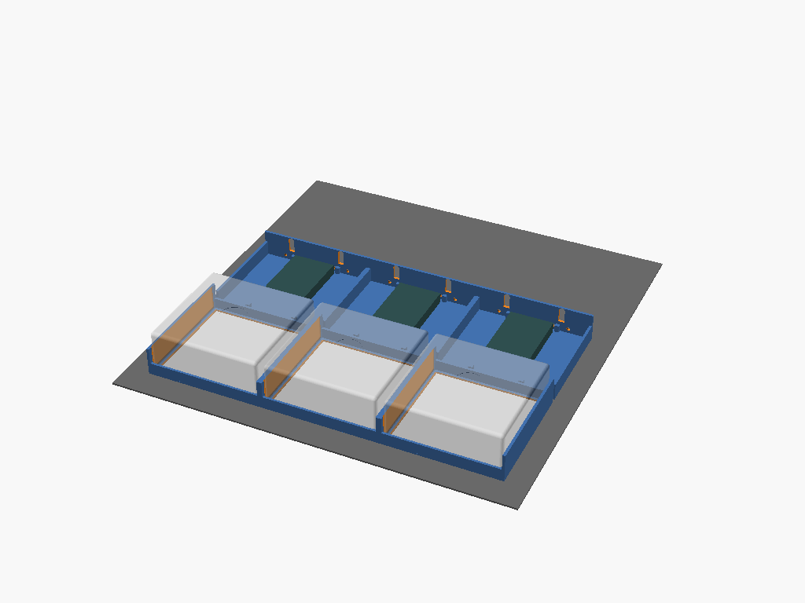
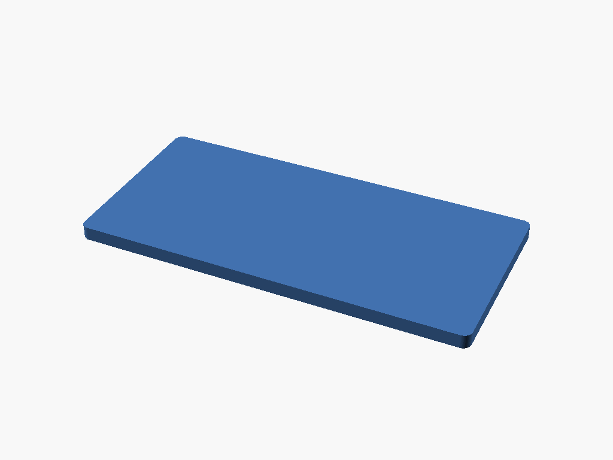
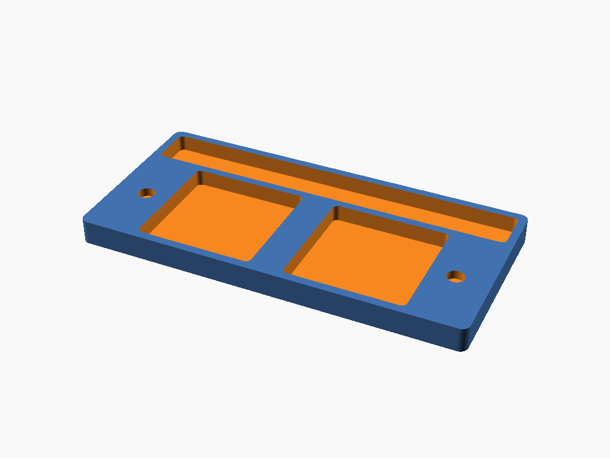

# 3d-models

OpenSCAD source for 3D-printable models. Every `.scad` file builds to **STL** (for slicing), **3MF** (richer modern format), and a **PNG preview** (shown below). Builds run automatically in GitHub Actions: artifacts on every push, attached to GitHub Releases on version tags.

## Layout

```
src/                 # OpenSCAD source (.scad) and optional .json customizer sidecars
build/               # Generated STL + 3MF (gitignored)
previews/            # Generated PNG renders (tracked in git so README renders on GitHub)
tools/build.py       # Build orchestrator (variants, parallelism, mtime-based rebuild)
Makefile             # Thin wrapper: make / make clean / make list / make force
.github/workflows/   # CI: build, manifold check, artifact upload, release attach
```

## Variant matrix (parametric models)

Drop a sidecar `src/<name>.json` next to `src/<name>.scad` using OpenSCAD's customizer format. Each entry under `parameterSets` produces one output:

```
src/box.scad
src/box.json     →   build/box.small.stl + .3mf + previews/box.small.png
                     build/box.large.stl + .3mf + previews/box.large.png
```

No sidecar → a single output set: `build/<name>.{stl,3mf}` + `previews/<name>.png`.

The customizer JSON is what OpenSCAD's GUI saves when you "Add new parameter set" — so you can author presets visually and the build picks them up.

## Local build

Install OpenSCAD (https://openscad.org/downloads.html), then:

```
make             # build STL + 3MF + previews; regenerate README models section
make force       # rebuild everything regardless of mtime
make list        # show planned targets (sources → outputs)
make clean       # wipe build/ and previews/*.png
```

On macOS the build auto-detects `/Applications/OpenSCAD.app`. Elsewhere it uses `openscad` on `PATH`. Override with `OPENSCAD=/path/to/openscad make`.

Builds run with `--hardwarnings`: non-manifold geometry, unset variables, and other warnings fail the build instead of silently producing broken STLs.

## Getting model files

- **Latest build:** Actions tab → most recent run → download the `models` artifact (contains all STL + 3MF).
- **Versioned release:** push a tag like `v0.1.0` — CI attaches every STL + 3MF to the GitHub Release.

```
git tag v0.1.0
git push origin v0.1.0
```

<!-- BEGIN MODELS -->

## Models

### `mac_mini`

Source: [`src/mac_mini.scad`](src/mac_mini.scad)



### `mac_mini_align_band`

Source: [`src/mac_mini_align_band.scad`](src/mac_mini_align_band.scad)

| Variant | Preview |
| --- | --- |
| `front_bar` |  |
| `rear_bar` |  |

### `mac_mini_align_grid`

Source: [`src/mac_mini_align_grid.scad`](src/mac_mini_align_grid.scad)

| Variant | Preview |
| --- | --- |
| `long_rail` |  |
| `short_rail` |  |

### `mac_mini_align_rails`

Source: [`src/mac_mini_align_rails.scad`](src/mac_mini_align_rails.scad)



### `mac_mini_cradle`

Source: [`src/mac_mini_cradle.scad`](src/mac_mini_cradle.scad)



### `mac_mini_rear`

Source: [`src/mac_mini_rear.scad`](src/mac_mini_rear.scad)



### `mini_shelf`

Source: [`src/mini_shelf.scad`](src/mini_shelf.scad)



### `puffco_knife_jar_tray`

Source: [`src/puffco_knife_jar_tray.scad`](src/puffco_knife_jar_tray.scad)

| Variant | Preview |
| --- | --- |
| `lid` |  |
| `tray` |  |

<!-- END MODELS -->
